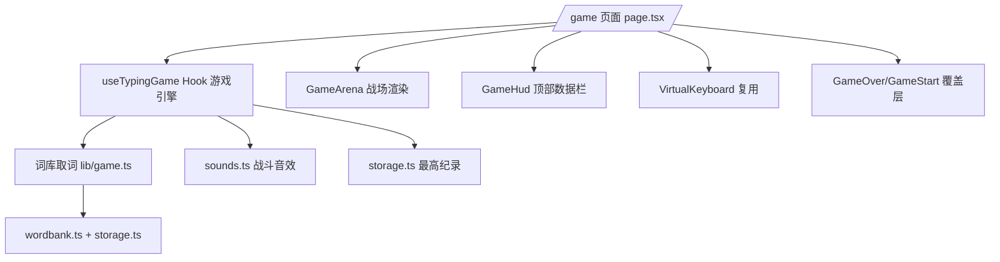

## 用户需求

新增打字游戏模块：参照 Steam 游戏【键来】的玩法，敌人携带英文单词从战场上方不断逼近底部防线，玩家通过键盘输入单词驱动战斗——输入匹配即锁定敌人、逐字母击破，打完全词击杀敌人并爆出分数与特效。截图所示的深色霓虹战场、命中特效（+XP / +ENERGY）、底部虚拟键盘高亮均需还原。

## 用户已确认的决策

1. 单词来源：复用 gallery 当前所选词库，取其中**单词**（word 词库直接取词；sentence 课程从句子拆分出单词），与打字练习数据打通。
2. 玩法规则：**生存模式**——敌人持续刷新并逐渐加速，漏过（越过底线）扣血，血量归零结束，结算展示得分 / 击杀数 / WPM / 准确率 / 历史最高纪录。
3. 移动端：**需要适配**，复用现有 VirtualKeyboard 组件可玩，nextKey 高亮当前锁定敌人的下一字符。

## 产品概览

在现有 EngExplorer 英语探索岛中新增「打字游戏」页面（路由 /game），导航栏增加游戏入口。整体为深色霓虹战斗风格：顶部 HUD 显示血量、得分、连击、击杀数、难度等级与能量条；中央战场中敌人携带单词缓缓下压；底部为虚拟键盘与防线。

## 核心功能

- 开始界面：展示当前词库、玩法说明，Enter/点击开始
- 敌人系统：随机取词生成敌人，从上方刷新并下移，速度随存活时间与击杀数递增；同屏敌人数量上限控制
- 打字战斗：按键匹配场上单词首字母时锁定该敌人，逐字母消字（已输入字母变色）；错键播错误音、连击归零；打完单词击杀，触发粒子爆发、飘分文字（+XP / +ENERGY）、击杀音效并朗读该单词
- 生存规则：敌人越过底部防线则扣血并震屏；血量归零进入结算
- 结算界面：得分 / 击杀数 / WPM / 准确率 / 最高连击，历史最高纪录 localStorage 持久化，支持再来一局
- 暂停机制：失焦 / 切页自动暂停，按任意键恢复，与打字练习页行为一致
- 移动端：底部复用 VirtualKeyboard，高亮当前目标下一字符
- 导航入口：桌面 TopBar 与移动端导航（底部 Tab + 侧滑菜单）均增加「打字游戏」

## 技术栈

- 沿用现有栈：Next.js 16 (App Router) + React 19 + TypeScript 5 + Tailwind CSS 4 + shadcn/ui
- 游戏循环：requestAnimationFrame + useRef 游戏状态（避免每帧 setState 造成 60fps 重渲染）
- 音效：扩展现有 `src/lib/sounds.ts` Web Audio 合成器，零资源文件
- 持久化：扩展现有 `src/lib/storage.ts` localStorage 封装

## 实现方案

### 核心策略

- **游戏引擎与渲染分离**：新建 `useTypingGame` Hook 承载纯逻辑（敌人生成/移动/锁定/击杀/扣血/计分），状态存于 ref，rAF 驱动；仅将需要渲染的轻量快照（敌人列表 id/word/progress/y、HUD 数值）以节流方式同步到 React state（如每帧更新敌人 transform 由 memo 化组件承担，同屏敌人上限 8 个，渲染开销可控，O(n) 匹配 n≤8）。
- **输入管线复刻 page.tsx**：全局 keydown 监听、ref 稳定化 handler、失焦/visibilitychange 自动暂停、错键不写入只计错，保持与打字练习页手感一致。
- **取词**：`initWordBanks` 后用 `getSelectedLessonId()` + `getBankContent(id)`；word 词库直接取 `words[].word`；sentence 课程用 `sentences[].words[].text`（或对 sentence 按空格分词兜底）。游戏不改动词库数据层。
- **难度曲线**：`spawnInterval` 与敌人速度随存活秒数与击杀数分段递增（如速度 base + kills*系数 + time*系数），血量固定 3 点起步。
- **飘分/粒子**：复用 `ParticleBurst`、`combo-effects` 中的可用件；新做轻量 FloatingText 组件承载 +XP/+ENERGY 飘字。
- **音效扩展**：sounds.ts 新增 `playKill`（上扬琶音）、`playHitDamage`（低频轰击）、`playCombo`，复用现有 playTone 包络工具。
- **纪录存储**：storage.ts 新增 `getGameBest/setGameBest`（score、kills、combo），沿用现有命名与 JSON 解析容错模式。

### 实现注意事项

- 性能：敌人移动只改 `transform: translateY`，避免触发 layout；HUD 计时 1s 粒度更新；组件用 memo 包裹，回调用 useCallback 稳定引用；页面卸载时 cancelAnimationFrame 并清理 keydown 监听。
- 日志：游戏为纯前端交互，无需新增日志；错误沿用静默降级（如 speechSynthesis 不可用时跳过朗读）。
- 兼容性：不改 page.tsx 既有逻辑；导航数组追加项不影响现有路由高亮判断（`/` 精确匹配，其余前缀匹配，`/game` 无冲突）。
- 移动端：游戏页在 md 断点下使用 MobileNav 提供的顶栏，虚拟键盘沿用现有尺寸与指法着色。

## 架构设计



## 目录结构

```
src/
├── app/
│   └── game/
│       └── page.tsx            # [NEW] 游戏页面：组装引擎/战场/HUD/虚拟键盘/开始与结算覆盖层；全局 keydown 输入、暂停恢复、TTS 朗读
├── components/
│   └── game/
│       ├── game-arena.tsx      # [NEW] 战场容器：深色霓虹背景网格、底部防线、渲染敌人列表与飘字层
│       ├── game-enemy.tsx      # [NEW] 单个敌人（memo）：霓虹发光卡片+单词字母逐字高亮、锁定态样式、受击/死亡动画
│       ├── game-hud.tsx        # [NEW] 顶部 HUD：血条、得分、击杀、连击、等级、能量条
│       ├── floating-text.tsx   # [NEW] +XP/+ENERGY/HEADSHOT 飘字特效，key 驱动自动消散
│       ├── game-start.tsx      # [NEW] 开始覆盖层：词库信息、玩法说明、开始按钮
│       └── game-over.tsx       # [NEW] 结算覆盖层：得分/击杀/WPM/准确率/最高纪录、再来一局
├── hooks/
│   └── use-typing-game.ts      # [NEW] 游戏引擎：rAF 循环、敌人生成/移动/锁定/击杀/扣血、计分/连击/WPM、难度曲线
├── lib/
│   ├── game.ts                 # [NEW] 游戏类型定义（GameEnemy/GameStats）+ 从所选词库提取单词 + 难度/计分常量
│   ├── sounds.ts               # [MODIFY] 新增 playKill/playHitDamage/playCombo 战斗音效
│   ├── storage.ts              # [MODIFY] 新增游戏最高纪录读写（getGameBest/setGameBest）
├── app/globals.css             # [MODIFY] 新增霓虹发光、敌人入场、飘字上浮、防线脉冲等动画 keyframes
└── components/layout/
    ├── header.tsx              # [MODIFY] navItems 追加 { href:'/game', label:'打字游戏', icon: Swords }
    └── mobile-nav.tsx          # [MODIFY] navItems 同步追加游戏入口
```

## 设计风格

采用赛博朋克霓虹 UI（参照【键来】截图）：深夜蓝黑战场为背景，敌人卡片与文字使用霓虹紫/青/粉发光描边，底部防线为脉冲青色光带。命中有 HEADSHOT 金色爆字与 +XP/+ENERGY 双色飘分；击杀时粒子爆发（复用 ParticleBurst）+ 屏幕微闪；受伤时红色震屏与裂纹（复用 ErrorCrack）。虚拟键盘保持现有指法配色，下一字符键位以霓虹高亮呼吸。布局自上而下：TopBar（沿用全局）→ HUD 数据栏 → 弹性战场区 → 能量条 → 虚拟键盘；移动端战场自适应收窄，键盘贴底。微交互：敌人悬停/锁定有 glow 呼吸，开始/结算覆盖层用 backdrop-blur 玻璃拟态，按钮 hover 上浮发光。